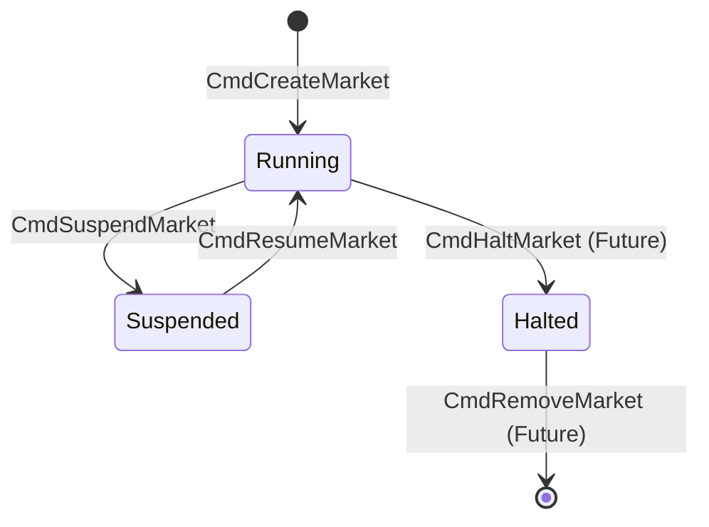

# Technical Specification: Matching Engine Management Commands

## 1. Background
目前撮合引擎（Matching Engine）的架構採用 **Event Sourcing** 模式，這意味著系統的當前狀態是通過重放歷史命令（Command Log）來重建的。然而，目前的 `MatchingEngine` 實作中，市場的生命週期管理（如創建市場 `AddOrderBook`）是透過直接的方法調用（Imperative API）執行的，而非通過命令流（Command Stream）。

### 痛點分析
1.  **非確定性恢復 (Non-deterministic Recovery)**: 當系統崩潰重啟並嘗試從 Snapshot + Command Log 恢復時，如果「創建市場」的操作沒有被記錄在 Command Log 中，引擎將無法知道需要初始化哪些 `OrderBook`。隨後針對這些市場的 `PlaceOrder` 或 `CancelOrder` 指令將會失敗（回傳 `ErrNotFound`），導致數據不一致。
2.  **缺乏審計 (Lack of Audit Trail)**: 管理操作（如暫停交易、修改市場參數）沒有被記錄在不可篡改的日誌中，難以追蹤運維行為。
3.  **架構完整性**: 混合了 Event Sourcing 與 RPC 風格的狀態修改，破壞了架構的一致性。

## 2. Objectives
- **確定性重放**: 確保所有改變引擎狀態的操作（包含管理操作）都可被持久化並重放。
- **統一指令模型**: 將管理指令納入統一的 `protocol.Command` 體系。
- **運維靈活性**: 支援動態創建、暫停、恢復市場，並支持未來的配置熱更新。

## 3. Current State & Gap Analysis
### Current Implementation
- `engine.go` 中的 `AddOrderBook` 是一個公開方法，直接操作 `sync.Map`。
- `protocol/command.go` 僅定義了交易相關指令 (`CmdPlaceOrder`, `CmdCancelOrder`, `CmdAmendOrder`)。
- `MatchingEngine.ExecuteCommand` 假設 `MarketID` 對應的 OrderBook 已經存在，否則報錯。

### Gaps
- 缺少 `CmdCreateMarket`, `CmdSuspendMarket`, `CmdResumeMarket` 等定義。
- `ExecuteCommand` 缺乏處理 "System Level" 指令的分支邏輯。

## 4. Technical Solution

### 4.1 Protocol Definition
擴充 `protocol` 包，新增管理相關的 Command Type 與 Payload。

#### Command Types

**編號分配策略 (已實作於 `protocol/command.go`)**:
- `0-50`: OrderBook Management Commands (內部管理操作)
- `51+`: Trading Commands (外部交易指令，高頻熱路徑)

```go
const (
    // OrderBook Management Commands (0-50, internal use)
    CmdUnknown       CommandType = 0
    CmdCreateMarket  CommandType = 1
    CmdSuspendMarket CommandType = 2
    CmdResumeMarket  CommandType = 3
    CmdUpdateConfig  CommandType = 4

    // Trading Commands (51+, external use)
    CmdPlaceOrder  CommandType = 51
    CmdCancelOrder CommandType = 52
    CmdAmendOrder  CommandType = 53
)
```

#### Payloads
**CreateMarketCommand**
```go
type CreateMarketCommand struct {
    UserID     string `json:"user_id"`     // Operator ID for audit trail
    MarketID   string `json:"market_id"`   // Unique market identifier
    MinLotSize string `json:"min_lot_size"` // Minimum trade unit (e.g., "0.00000001")
}
```

**SuspendMarketCommand**
```go
type SuspendMarketCommand struct {
    UserID   string `json:"user_id"`
    MarketID string `json:"market_id"`
    Reason   string `json:"reason"`
}
```

**ResumeMarketCommand**
```go
type ResumeMarketCommand struct {
    UserID   string `json:"user_id"`
    MarketID string `json:"market_id"`
}
```

**UpdateConfigCommand**
```go
type UpdateConfigCommand struct {
    UserID   string `json:"user_id"`
    MarketID string `json:"market_id"`
    MinLotSize *string `json:"min_lot_size,omitempty"`
}
```


### 4.2 Architecture Design (Data Flow)

**Admin -> MQ -> Matching Engine**

1.  **Admin Service**: 發送 `CmdCreateMarket` 到 MQ（Topic 應與交易指令相同，確保時序，或需保證嚴格順序）。
2.  **Matching Engine (Ingress)**: 消費 Command。
3.  **Engine Dispatch**:
    - **Check Command Type**:
        - 如果是 `CmdCreateMarket`:
            1. 檢查 `MarketID` 是否已存在。
            2. 如果不存在，初始化新的 `OrderBook` (包含應用 `MinLotSize` 等配置)。
            3. 將該 OrderBook 註冊到引擎。
            4. 寫入 Sequence ID，確保該操作被記錄。
        - 如果是 `CmdSuspendMarket`:
            1. 獲取對應 `MarketID` 的 OrderBook。
            2. 設置 OrderBook 狀態為 `Suspended` (需新增此狀態)。
        - 如果是普通交易指令 (`Place/Cancel/Amend`):
            1. 獲取 OrderBook。
            2. **Check Status**: 如果市場處於 `Suspended`，拒絕指令 (回傳 `ErrMarketSuspended`)。
            3. 執行撮合邏輯。

### 4.3 Core Implementation Details

#### Engine Routing Logic
```go
func (engine *MatchingEngine) ExecuteCommand(cmd *protocol.Command) error {
    // 1. System Level Commands
    switch cmd.Type {
    case protocol.CmdCreateMarket:
        return engine.handleCreateMarket(cmd)
    case protocol.CmdSuspendMarket:
        return engine.handleSuspendMarket(cmd)
    case protocol.CmdResumeMarket:
        return engine.handleResumeMarket(cmd)
    }

    // 2. Market Level Commands
    orderbook := engine.OrderBook(cmd.MarketID)
    if orderbook == nil {
        return ErrNotFound
    }
    
    // ... delegation to orderbook
}
```

#### Struct Updates (Action Item)
開發者需注意，目前的 `OrderBook` 結構缺乏以下字段，必須擴充：
1.  **`state OrderBookState`**: 用於管理生命週期 (Running/Suspended/Halted)。

#### OrderBookState 狀態機定義

**狀態轉換圖**:


**狀態轉換矩陣**:

| 當前狀態 | 目標狀態 | 觸發指令 | 允許的交易操作 |
|----------|----------|----------|----------------|
| (初始) | `Running` | `CmdCreateMarket` | - |
| `Running` | `Suspended` | `CmdSuspendMarket` | Place/Cancel/Amend |
| `Suspended` | `Running` | `CmdResumeMarket` | Cancel only |
| `Running` | `Halted` | `CmdHaltMarket` (Future) | None |
| `Halted` | (移除) | `CmdRemoveMarket` (Future) | None |

**狀態定義 (已實作於 `protocol/command.go`)**:
```go
type OrderBookState uint8

const (
    OrderBookStateRunning   OrderBookState = 0 // 正常交易中
    OrderBookStateSuspended OrderBookState = 1 // 暫停交易，可恢復
    OrderBookStateHalted    OrderBookState = 2 // 永久停止，待刪除
)
```

#### Async Error Handling
由於 `ExecuteCommand` 在 System Command 路徑上是異步執行 (寫入 MQ/CommandLog)，無法直接返回業務錯誤給發送者。

**開發者必須實作**:
- 當 `handleCreateMarket` (或其他管理指令) 驗證失敗時，必須產生一條標準的 **`OrderBookLog`**。
- 設定 `LogType` 為 **`protocol.LogTypeReject`**。
- 設定 `RejectReason` 為具體錯誤原因。
- **統一性原則**: 無論是交易指令失敗還是管理指令失敗，輸出的 Log 結構皆為 `OrderBookLog`。

**完整 RejectReason 清單 (已實作於 `protocol/types.go`)**:
```go
const (
    // Trading Reject Reasons
    RejectReasonNone             RejectReason = ""
    RejectReasonNoLiquidity      RejectReason = "no_liquidity"
    RejectReasonPriceMismatch    RejectReason = "price_mismatch"
    RejectReasonInsufficientSize RejectReason = "insufficient_size"
    RejectReasonPostOnlyMatch    RejectReason = "post_only_match"
    RejectReasonDuplicateID      RejectReason = "duplicate_order_id"
    RejectReasonOrderNotFound    RejectReason = "order_not_found"
    RejectReasonInvalidPayload   RejectReason = "invalid_payload"

    // Market Management Reject Reasons
    RejectReasonMarketNotFound      RejectReason = "market_not_found"
    RejectReasonMarketAlreadyExists RejectReason = "market_already_exists"
    RejectReasonMarketSuspended     RejectReason = "market_suspended"
    RejectReasonMarketHalted        RejectReason = "market_halted"
    RejectReasonUnauthorized        RejectReason = "unauthorized"
)
```

#### OrderBook State Management
當收到交易指令時，根據市場狀態進行檢查：

| 市場狀態 | PlaceOrder | CancelOrder | AmendOrder |
|----------|------------|-------------|------------|
| `Running` | ✅ 允許 | ✅ 允許 | ✅ 允許 |
| `Suspended` | ❌ Reject | ✅ 允許 | ❌ Reject |
| `Halted` | ❌ Reject | ❌ Reject | ❌ Reject |

若狀態不允許該操作，產生 `OrderBookLog` (Type: `Reject`, Reason: `MarketSuspended` 或 `MarketHalted`)。

### 4.4 API Refactoring & Standardization
現有 `MatchingEngine` 的公開方法大多混合了業務邏輯與指令發送，導致職責不分。我們將全面重構以下方法：

#### 1. Lifecycle Management Methods (Refactor Required)
這些方法目前直接修改狀態，必須改為發送指令。
- **`AddOrderBook(marketID)`** -> **`CreateMarket(marketID, config)`**: 
    - 產生 `CmdCreateMarket` 並調用 `ExecuteCommand`。
    - 移除原本直接操作 `orderbooks` Map 的邏輯。

#### 2. Trading Methods (Standardization Required)
這些方法目前雖然邏輯正確，但路徑是 `engine.PlaceOrder` -> `orderbook.PlaceOrder` -> `orderbook.ExecuteCommand` (內部)。
**問題**: 這種直接調用跳過了 `engine.ExecuteCommand` 的中央路由層，該層是我們計劃實施**引擎級管理邏輯**的地方。

**調整計畫**:
- **`PlaceOrder(...)`**: 改為封裝 `CmdPlaceOrder` -> 調用 `engine.ExecuteCommand`。
- 目標是讓所有進入 Engine 的操作都**唯一地**通過 `engine.ExecuteCommand` 入口。

**Why "Global Suspension Check"?**
所謂「缺乏統一路由保護」，是指如果我們想實現「全站停機維護」或「熔斷機制」，目前的直接調用路徑需要分別在 `PlaceOrder`, `CancelOrder` 等每個方法中插入檢查代碼。
通過將所有請求導向 `ExecuteCommand`，我們可以實現一個統一的攔截點 (Interception Point)：

```go
func (e *MatchingEngine) ExecuteCommand(cmd *protocol.Command) error {
    // 1. Unified Interception: Global Circuit Breaker / Suspension
    if e.IsGloballySuspended() && !IsAdminCommand(cmd) {
        return ErrSystemSuspended
    }
    
    // 2. Routing ...
    switch cmd.Type {
        // ... system routing ...
        // ... trading routing ...
    }
}
```
如果不進行標準化，我們就無法在這個單一點上有效地攔截所有交易流量。這個設計確保了系統具備高度的可管控性與一致性。

#### API 重構影響範圍評估

**受影響的方法列表**:

| 方法 | 當前狀態 | 重構動作 | 影響範圍 |
|------|----------|----------|----------|
| `AddOrderBook(marketID)` | 直接操作 sync.Map | 改為產生 `CmdCreateMarket` | `engine.go`, `engine_test.go` |
| `PlaceOrder(...)` | 直接調用 orderbook | 改為封裝 `CmdPlaceOrder` | `engine.go`, `engine_test.go` |
| `CancelOrder(...)` | 直接調用 orderbook | 改為封裝 `CmdCancelOrder` | `engine.go`, `engine_test.go` |
| `AmendOrder(...)` | 直接調用 orderbook | 改為封裝 `CmdAmendOrder` | `engine.go`, `engine_test.go` |

**重構策略**:
直接重構，一步到位。將所有寫入方法內部邏輯改為封裝 Command 並調用 `ExecuteCommand`，同時更新測試以配合新 API。

**測試影響評估**:
- `engine_test.go`: 約 347 行，包含 3 個主要測試函數
- 預計需調整的測試: `TestMatchingEngine`, `TestMatchingEngineShutdown`, `TestEngineSnapshotRestore`
- **建議**: 重構時優先確保現有測試通過，再新增管理指令相關測試

### 4.5 Snapshot Strategy Discussion
**Q: 為什麼 TakeSnapshot 不走 MQ (Command)?**

**A:**
1.  **性質不同**: Command 是「意圖修改狀態」的操作，而 Snapshot 是「讀取並持久化當前狀態」的操作。
2.  **性能考量**: Snapshot 涉及大量的磁碟 I/O。如果將其作為一個 Command 放入處理隊列，它將阻塞相同隊列後的交易指令，導致顯著的延遲抖動 (Latency Jitter)。
3.  **現有機制**: 目前的 `OrderBook.TakeSnapshot` 內部已經利用了 RingBuffer (InputEvent) 來確保與交易處理的線程安全。
4.  **結論**: Snapshot 保持為管理平面的 RPC 調用。它不需被「重放」，因為它的產物 (`snapshot.bin`) 本身就是重放的起點。


#### 3. New Management Methods (To Be Added)
新增以下 Helper 方法以支援新的 Operational Commands：
- **`SuspendMarket(marketID, reason)`**: 產生 `CmdSuspendMarket`。
- **`ResumeMarket(marketID)`**: 產生 `CmdResumeMarket`。
- **`UpdateMarketConfig(marketID, config)`**: 產生 `CmdUpdateConfig` (支援動態調整 TickSize/LotSize)。

#### 4. Read-Only Methods (No Change)
讀取類方法不涉及狀態修改，保持原樣：
- `OrderBook(marketID)`
- `TakeSnapshot`, `RestoreFromSnapshot`

#### Refactoring Pattern Example
所有寫操作方法都將遵循以下模式：
```go
func (e *MatchingEngine) CreateMarket(marketID string, config MarketConfig) error {
    // 1. Construct Payload
    payload := &protocol.CreateMarketCommand{...}
    
    // 2. Wrap in Command Envelope
    cmd := &protocol.Command{
        Type: protocol.CmdCreateMarket,
        Payload: serializer.Marshal(payload),
    } // SeqID assigned later or by caller
    
    // 3. Single Entry Point
    return e.ExecuteCommand(cmd)
}
```
`ExecuteCommand` 將成為唯一的 Write path 入口，負責路由與分發。

## 5. Validation & Testing Strategy

### 5.1 Functionality Verification
- **Test Case 1: Dynamic Creation**:
    - 發送 `CmdCreateMarket("BTC-USDT")`。
    - 緊接著發送 `CmdPlaceOrder("BTC-USDT")`。
    - 驗證：訂單成功被接受，而不是 `ErrNotFound`。
- **Test Case 2: Suspension enforcement**:
    - 發送 `CmdSuspendMarket("BTC-USDT")`。
    - 發送 `CmdPlaceOrder`。
    - 驗證：收到 `RejectLog` (Reason: MarketSuspended)。

### 5.2 Deterministic Replay Verification
- **Scenario**:
    1. 啟動引擎。
    2. 發送 CreateMarket -> PlaceOrder -> PlaceOrder。
    3. 執行 `TakeSnapshot`。
    4. Kill 引擎進程。
    5. 重啟引擎並載入 Snapshot。
    6. 驗證：市場存在，且訂單狀態恢復正確。

## 6. Caveats & Trade-offs
- **Latency Impact**: 在 `ExecuteCommand` 入口增加 `switch` 判斷對性能影響極微，但反序列化 Payload 仍有開銷。
- **Error Handling**: 如果 `CmdCreateMarket` 參數錯誤（例如無效的 Precision），引擎如何反饋？在 Event Sourcing 中，Command 已經發生，我們只能產生一個 "CommandFailed" 的事件日誌，而不能像 RPC 那樣直接返回 error 給調用者。
- **Versioning**: 未來修改 `CreateMarketCommand` 結構（如新增字段）需注意向前兼容，否則舊的 Command Log 回放時可能出錯。

---

## 7. Architecture Review (架構評審)

> **評審日期**: 2025-12-31  
> **評審人**: 首席架構師

### 7.1 評審結論

✅ **通過 (Approved with Recommendations)**

本規格書的架構方向**正確且必要**，精準識別了 Event Sourcing 架構中管理操作的核心問題。以下為詳細評審意見。

---

### 7.2 規格書優點

| 項目 | 評價 |
|------|------|
| **問題識別 (§1)** | ✅ 準確指出 `AddOrderBook` 繞過 Command Log 導致的非確定性恢復風險 |
| **統一指令模型 (§4.2)** | ✅ 將管理指令納入 `protocol.Command` 體系，保持架構一致性 |
| **中央路由設計 (§4.4)** | ✅ 透過 `ExecuteCommand` 實現統一攔截點，支援未來的熔斷/全站暫停機制 |
| **Snapshot 策略 (§4.5)** | ✅ 正確分離 "讀取狀態" 與 "修改狀態" 操作，避免 Snapshot 阻塞交易流 |
| **異步錯誤處理 (§4.3)** | ✅ 採用 `OrderBookLog` 統一輸出結構，符合 Event Sourcing 原則 |

---

### 7.3 發現的問題與風險

#### 7.3.1 Command Type 編號衝突風險 ✅ 已解決

現已在 `protocol/command.go` 中明確定義編號策略：
- `0-50`: OrderBook Management Commands (內部管理操作)
- `51+`: Trading Commands (外部交易指令)

---

#### 7.3.2 OrderBookState 狀態機定義 ✅ 已補充

已在 §4.3 補充完整的狀態機定義，包含：
- 狀態轉換圖 (Mermaid)
- 狀態轉換矩陣
- 各狀態允許的操作

---

#### 7.3.3 MarketConfig 持久化策略 (Pending)

> [!NOTE]
> 目前 `CreateMarketCommand` 已簡化為僅包含 `MinLotSize`，與現有 `OrderBook.lotSize` 字段對應。
> 現有 Snapshot 機制已支援 `lotSize` 的持久化，無需額外擴充。
> 如未來新增其他配置項，再擴充 `OrderBookSnapshot` 結構。

---

#### 7.3.4 UserID 類型一致性 ✅ 已統一

管理指令 (`CreateMarketCommand`, `SuspendMarketCommand`, `ResumeMarketCommand`, `UpdateConfigCommand`) 的 `UserID` 統一採用 `string` 類型。

> [!NOTE]
> 交易指令 (`PlaceOrderCommand`, `CancelOrderCommand`, `AmendOrderCommand`) 仍使用 `int64`。
> 這是有意為之：管理操作通常由 Admin Service 發起，UserID 可能是 UUID；交易指令來自客戶端，使用數字 ID 更高效。
> 如需完全統一，可在後續版本評估。

---

#### 7.3.5 RejectReason 擴充 ✅ 已實作

已在 `protocol/types.go` 添加完整的管理相關 RejectReason：
- `RejectReasonMarketNotFound`
- `RejectReasonMarketAlreadyExists`
- `RejectReasonMarketSuspended`
- `RejectReasonMarketHalted`
- `RejectReasonUnauthorized`

---

#### 7.3.6 API 重構影響範圍 ✅ 已補充

已在 §4.4 補充詳細的影響範圍評估表格與重構策略。

---

### 7.4 具體行動項目 (Action Items)

| # | 優先級 | 項目 | 狀態 |
|---|--------|------|------|
| 1 | ~~P0~~ | ~~補充 `MarketState` 狀態機定義與轉換矩陣~~ | ✅ 已完成 |
| 2 | ~~P0~~ | ~~統一管理指令 `UserID` 類型為 `string`~~ | ✅ 已完成 |
| 3 | ~~P1~~ | ~~定義 Command Type 編號分配策略~~ | ✅ 已完成 |
| 4 | ~~P1~~ | ~~列出完整的 `RejectReason` 擴充清單~~ | ✅ 已完成 |
| 5 | ~~P2~~ | ~~補充 API 重構影響範圍評估~~ | ✅ 已完成 |

---

### 7.5 結語

本規格書已完成所有評審建議的修訂，架構設計完整且可執行。

✅ **批准進入開發階段**

---
*End of Architecture Review*

