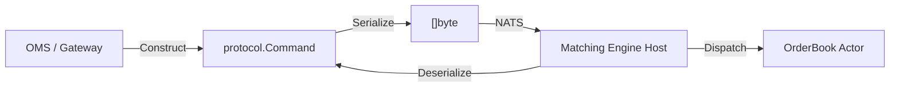
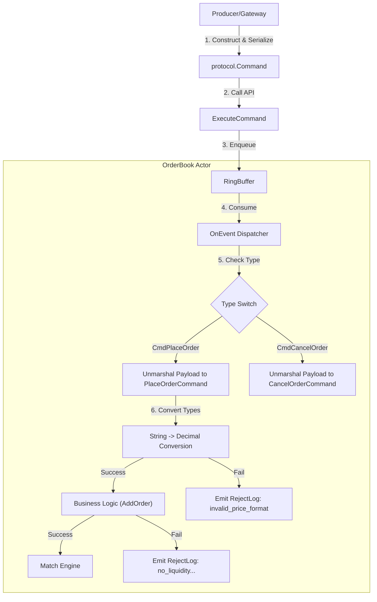

# Unified Command Protocol Specification

## 1. Background (背景)
目前 Matching Engine 的 `OrderBook` 與 `Engine` 層級直接依賴內部的資料結構與方法呼叫。在微服務架構中，指令（Command）通常源自外部 Message Queue (如 NATS)，並由上游服務（如 OMS, Gateway）發送。

為了確保上下游服務（SDK 使用者）與 Matching Engine 之間的通訊協議一致，並支持 Event Sourcing 與 Actor Model 架構，我們需要定義一套標準化的 **Unified Command Protocol**。此協議將作為各個服務間共享的合約 (Contract)，存放於 `protocol` 套件中。

## 2. Objectives (目標)
- **標準化 (Standardization)**: 定義統一的 `Command` 結構，作為系統間資料交換的標準載體。
- **解耦 (Decoupling)**: 透過 `protocol` package 共享定義，讓上游服務（Producer）與 Engine（Consumer）依賴於介面而非具體實作。
- **高效能 (Performance)**: 結構設計需考慮序列化效率與 Golang Memory Layout，減少非必要的 GC 壓力。
- **可擴展性 (Extensibility)**: 支援未來的指令類型擴充，而不破壞現有架構。

## 3. Current State & Gap Analysis (現況分析)
### Current State
- `OrderBook` 內部直接處理具體的業務邏輯方法 (`AddOrder`, `CancelOrder`)。
- 缺乏統一的外部通訊協議結構，依賴開發人員手動對接 NATS Msg 與內部結構。
- `protocol` 目錄尚未被有效利用作為 SDK 共享層。

### Gaps
- **Lack of Contract**: 上下游缺乏明確的 Data Contract，容易導致整合錯誤。
- **Serialization Overhead**: 若無統一結構，可能導致多次無效的序列化/反序列化。

## 4. Technical Solution (技術方案)

### 4.1 Architecture Design
採用 **Shared Kernel** 模式，將 `protocol` 獨立為一個 GO module 或共享 package。



### 4.2 Core Implementation
所有定義位於 `protocol` package 下，供 SDK 使用。

#### Command Structure
> **Serialization Strategy**: 
> 為保持靈活性，我們在 `protocol` 中定義了 `Serializer` 介面。`OrderBook` 初始化時應支援透過 Option Pattern (e.g., `WithSerializer`) 注入具體的實作，若未注入則預設使用 `JSONSerializer`。
> 
> ```go
> // protocol/serializer.go
> type Serializer interface {
>     Marshal(v any) ([]byte, error)
>     Unmarshal(data []byte, v any) error
> }
> ```
> 
> 外部系統需確保 `Payload` 的編碼格式與 Engine 內部使用的 `Serializer` 一致。

```go
package protocol

// CommandType 定義指令類型 (使用 uint8 優化內存佔用與比較效能)
type CommandType uint8

const (
	CmdUnknown     CommandType = 0
	CmdPlaceOrder  CommandType = 1
	CmdCancelOrder CommandType = 2
	CmdAmendOrder  CommandType = 3
	// ... extensions
)

// Command 是 Matching Engine 接收的標準指令封包
// 必須保持簡單 (POJO)，不包含業務邏輯
type Command struct {
	// Version 協議版本號，用於未來向後相容升級 (建議保留)
	Version uint8 `json:"version"`

	// SeqID 用於全域排序與去重 (Event Sourcing 關鍵)
	SeqID uint64 `json:"seq_id"`

	// Type 標識 Payload 的具體類型，用於快速路由
	Type CommandType `json:"type"`

	// Payload 存放具體業務數據的序列化結果 (e.g., Protobuf/JSON bytes)
	// 延遲反序列化 (Lazy Deserialization) 以優化 Router 效能
	Payload []byte `json:"payload"`

	// Metadata 用於存放非業務邏輯的上下文 (e.g., Tracing ID, Source IP)
	Metadata map[string]string `json:"metadata,omitempty"`
}
```

#### OrderBook Interface Definition (Engine API)
為了確保開發人員理解 Engine 的統一入口，我們定義以下介面合約：

```go
// OrderBook Actor 接口
// 這是 Matching Engine 的唯一寫入入口，所有狀態變更必須通過此函數。
type OrderBookAPI interface {
    // ExecuteCommand 接收通用指令並提交執行。
    // 注意：此函數通常是異步的，僅負責將指令寫入 RingBuffer/Channel。
    // 錯誤回傳通常只代表 "寫入失敗" (e.g., buffer full, shutdown)，
    // 而非業務邏輯錯誤。業務錯誤會透過 Event Stream (PublishLog) 輸出。
    ExecuteCommand(cmd *protocol.Command) error
}
```

#### Payload Structures
> 詳細字段定義請參閱 `protocol/command.go`

- **PlaceOrderCommand**: 下單指令 payload
- **CancelOrderCommand**: 刪單指令 payload
- **AmendOrderCommand**: 改單指令 payload

### 4.3 Performance Considerations
1.  **Lazy Deserialization**: Host 層只解第一層 `Command` struct，讀取 `Type` 後將 `Payload` 原樣傳入特定的 Actor Channel，由 Consumer Goroutine 進行第二次反序列化（Zero-copy if possible）。
2.  **Memory Layout**: `Command` 結構體欄位按照 8-byte alignment 排列 (SeqID first)，減少 Padding 浪費。
### 4.4 Query & Synchronous Operations (Read Model)
您提到的 `Depth()` 等方法屬於 **Query (Read Operation)**，其特性是：
1.  **Read-Only**: 不改變系統狀態，因此不需要 SeqID，也不需要被持久化到 WAL。
2.  **Synchronous**: Caller (e.g. Gateway) 往往需要即時等待結果 (Request-Response)。

針對這類需求，我們採用 **Internal Event Envelope** 模式來處理：

#### Architecture
Matching Engine 的 RingBuffer 不僅僅接收 `protocol.Command`，而是接收一個通用的 `InputEvent` 封套：

```go
// Engine 內部的 Event 定義 (不公開於 protocol，僅存在於 engine 實作層)
type InputEvent struct {
    // Write Path: 來自 MQ 的標準指令
    Cmd *protocol.Command
    
    // Read Path: 來自 gRPC/HTTP 的查詢請求
    Query any // e.g. *protocol.GetDepthRequest
    Resp  chan any // 用於回傳結果給 Caller
}
```

#### Internal Processing Workflow (實作細節)
為了釐清 `ExecuteCommand` 與 Actor 的職責，以下為內部處理流程：



**Data Type Conversion Strategy**:
- `protocol` 層使用 `string` 表示價格與數量，以確保跨語言精度傳輸。
- **Engine Host (Actor)** 負責在反序列化後，調用 `udecimal.Parse` 將其轉換為內部計算用的 `udecimal.Decimal`。
- 若轉換失敗，視為格式錯誤，直接發送 `RejectLog` (Reason: `invalid_payload` 或 `invalid_price_format`)。

#### Query Protocol
> 詳細字段定義請參閱 `protocol/command.go`

- **GetDepthRequest**: 查詢深度 Request
- **GetStatsRequest**: 查詢統計 Request

#### Shared Data Types (Response Models)
> 詳細字段定義請參閱 `protocol/types.go`

- **GetDepthResponse**: 深度查詢回傳
- **GetStatsResponse**: 統計查詢回傳

### 4.5 Output Event Stream (Write Model Response)
Matching Engine 採用 Event Sourcing，所有的狀態變更結果（包含成功與失敗）皆透過 Event Log 輸出。開發人員需實作 `PublishLog` 接口來處理這些便更。

**Event Types (目前定義於 `models.go`，建議未來移入 `protocol`):**
1.  **OpenLog**: 訂單成功掛單 (Maker)
2.  **MatchLog**: 訂單撮合成功 (Trade)
3.  **CancelLog**: 訂單取消成功
4.  **AmendLog**: 訂單修改成功
5.  **RejectLog**: 指令被拒絕。常見原因如下：
    - `no_liquidity`: 市場單/IOC 無流動性
    - `price_mismatch`: 價格不符
    - `insufficient_size`: 數量不足
    - `post_only_match`: PostOnly 訂單會立刻撮合
    - `duplicate_order_id`: 訂單 ID 重複
    - `order_not_found`: 找不到訂單 (Cancel/Amend)
    - `invalid_payload`: 反序列化或格式轉換失敗 (e.g. 價格非數字)

#### Workflow
1.  **Command (Write)**: Gateway -> NATS -> `protocol.Command` -> Engine -> `InputEvent{Cmd: c}` -> RingBuffer.
2.  **Query (Read)**: Gateway -> gRPC -> `protocol.GetDepthRequest` -> Engine -> `InputEvent{Query: q, Resp: ch}` -> RingBuffer.

這樣既然保持了 `protocol.Command` 的 Event Sourcing 純粹性，也滿足了 `Depth()` 的同步查詢需求。


## 5. Validation & Testing (驗證策略)

### 5.1 Unit Testing Strategy
由於 `AddOrder` 等公開方法被移除，單元測試需模擬真實的 Command 流程：

1.  **Mock PublishLog**: 實作一個 `MockTrader` 來捕獲 `OrderBook` 輸出的 Events (`MatchLog`, `RejectLog`)，驗證業務邏輯正確性。
2.  **Command Construction Helper**: 編寫輔助函數（e.g. `mockCommand(payload)`) 將業務結構體包裝成 `protocol.Command`，簡化測試代碼。
3.  **State Verification**: 透過 `GetDepth` 或 `GetStats` (Query Facade) 驗證 In-Memory 狀態變更。

```go
// Test Example
func TestOrderBook_PlaceOrder(t *testing.T) {
    // Setup
    captor := NewMockLogCaptor() 
    ob := NewOrderBook(..., captor)
    
    // Act
    cmd := NewPlaceOrderCmd("market1", "order1", SideBuy, ...)
    ob.ExecuteCommand(cmd)

    // Assert Event Output
    assert.Equal(t, 1, len(captor.Logs))
    assert.Equal(t, "MatchLog", captor.Logs[0].Type)

    // Assert State (Synchronous Query)
    depth, _ := ob.Depth(5)
    assert.Equal(t, ..., depth.Bids[0].Size)
}
```

### 5.2 Integration & Performance
- **Replay Test**: 錄製一段真實流量的 Command Log，透過 `ExecuteCommand` 重放，確保最終狀態 Hash 一致。
- **Benchmark**: 關注 `Serializer` -> `Dispatcher` -> `Actor` 路徑的額外開銷 (Latency Overhead)。

## 6. Caveats & Trade-offs (注意事項)
- **Trade-off**: 引入 `protocol` 層會增加一層依賴，修改指令結構時需要重新編譯所有依賴服務。
- **Risk**: `Payload` 為 `[]byte` 雖然靈活，但喪失了編譯期類型檢查，需在 Runtime 嚴格校驗 `Type` 與 `Payload` 的匹配。

---

## 7. 架構評審記錄

> **評審日期**: 2025-12-30  
> **評審角色**: 撮合引擎首席架構師  
> **評審結果**: ✅ **通過 (APPROVED)**

### 評估總結

| 評估項目 | 狀態 | 說明 |
|----------|------|------|
| 架構設計 | ✅ 通過 | Shared Kernel + Lazy Deserialization 模式合理 |
| 性能考量 | ✅ 通過 | Memory Layout 與序列化策略設計得當 |
| 可擴展性 | ✅ 通過 | `CommandType` 預留擴展空間，新增 `Version` 欄位支援未來升級 |
| 開發可實作性 | ✅ 通過 | 流程圖清晰、類型轉換責任明確、錯誤碼完整 |

### 設計亮點

1. **兩階段反序列化 (Lazy Deserialization)**
   - Host 層只解析 `Command` 外殼，根據 `Type` 路由後由 Actor 負責 `Payload` 反序列化
   - 優點：減少 Router 的 CPU 開銷，符合 Zero-copy 精神

2. **Command 結構體 Memory Layout**
   - `SeqID` (uint64) 放首位，符合 8-byte alignment
   - `Version` + `Type` (uint8 + uint8) 可合併為 2 bytes，後續欄位仍保持對齊

3. **Read/Write 分離設計**
   - Write Path: `protocol.Command` → NATS → Event Sourcing
   - Read Path: `protocol.GetDepthRequest` → gRPC → Synchronous Response
   - 符合 CQRS 架構原則

4. **完整的錯誤處理**
   - `RejectLog` 列出 7 種拒絕原因，涵蓋業務錯誤與格式錯誤
   - 類型轉換責任明確落在 Engine Actor 層

### 後續建議（非必要）

| 建議 | 說明 |
|------|------|
| **MarketID 路由說明** | 可補充 Host 如何根據 `Payload` 中的 `MarketID` 路由到對應 Actor |
| **Benchmark 基準線** | 設定目標：單次 `Serialize → Dispatch → Deserialize` 延遲 < 10μs |
| **Event Types 遷移** | 將 `models.go` 中的 Event Types 遷移至 `protocol/` 套件 |

---

*架構評審通過，開發團隊可進入實作階段。*
